# ka-proxy

A simple yet powerful Nginx-based reverse proxy container that dynamically routes traffic to different services based on domain names. This proxy automatically handles HTTP to HTTPS redirection and SSL termination for your web applications.

## Description

ka-proxy is a Docker-based reverse proxy solution that:

- Routes traffic to different services based on domain names
- Handles SSL termination
- Automatically redirects HTTP traffic to HTTPS
- Configures itself dynamically based on a JSON configuration file
- Is designed to be easily deployed and updated via GitHub Actions


## Features

- **Dynamic Configuration**: Define your services and domains in a simple JSON format
- **SSL Support**: Automatically handles certificates for secure connections
- **Docker-based**: Runs in a containerized environment for easy deployment
- **GitHub Actions Integration**: Automated deployment workflow
- **Zero-downtime Updates**: Updates proxy configuration without affecting other services

## Installation

### Prerequisites

- Docker and Docker Compose installed on your server
- SSL certificates for your domains (placed in the directory specified by `CERTS_PATH`)
- A server with ports 80 and 443 available

### Setup Steps

1. **Clone the repository**:

   ```bash
   git clone https://github.com/yourusername/ka-proxy.git
   cd ka-proxy
   ```

2. **Configure your applications**:
   Create an `apps.json` file based on the provided example:

   ```bash
   cp apps.json.example apps.json
   ```

   Then edit the `apps.json` file to include your domains and services.

3. **Set the certificates path**:
   Edit the `.env` file to point to your SSL certificates directory:

   ```bash
   CERTS_PATH=/path/to/your/ssl/certificates
   ```

4. **Run the proxy**:

   ```bash
   docker-compose up -d
   ```

## Configuration

### Apps.json Structure

The `apps.json` file is the core configuration file that defines how traffic is routed. Each entry should contain:

```json
{
	"domains": ["example.com", "www.example.com"], // List of domain names
	"service": "service-name", // Docker service name to route to
	"port": 80, // Port the service is running on
	"certsPath": "/etc/ssl/ka-proxy/example.com" // Path to SSL certificates
}
```

### SSL Certificates

Certificates should be organized in the following directory structure:

```
CERTS_PATH/
├── domain1/
│   ├── cert.pem
│   ├── privkey.pem
│   └── chain.pem
├── domain2/
│   ├── cert.pem
│   ├── privkey.pem
│   └── chain.pem
└── ...
```

Each domain has its own subdirectory under the CERTS_PATH directory containing the required certificate files:

- `cert.pem`: SSL certificate
- `privkey.pem`: Private key
- `chain.pem`: Certificate chain

In your apps.json file, the certsPath property must be an absolute path that is located within the CERTS_PATH directory specified in your .env file. For example, if CERTS_PATH=/etc/ssl/ka-proxy, then your certsPath in apps.json might be /etc/ssl/ka-proxy/domain1.

## GitHub Actions Deployment

This project includes a GitHub Actions workflow for automated deployment.

### How the Deployment Works

1. When code is pushed to the `main` branch, the workflow is triggered
2. The workflow connects to your server via SSH
3. It copies the necessary configuration files to the server
4. It rebuilds and restarts only the proxy service without affecting other services

### Required Secrets

To use the GitHub Actions workflow, you need to set up the following secrets in your GitHub repository:

- `SSH_PRIVATE_KEY`: Your SSH private key for connecting to the server
- `SSH_USER`: Username for SSH connection
- `SSH_HOST`: Hostname or IP address of your server
- `APPS_JSON`: (Optional) Contains the content of your apps.json file - this allows you to keep sensitive domain configuration information secure by storing it as a GitHub secret rather than committing it to the repository

## Technical Details

The diagram below illustrates how `ka-proxy` works:



### Architecture

ka-proxy uses a simple but effective architecture:

1. The Nginx container acts as the frontend, receiving all HTTP/HTTPS requests
2. Based on the hostname in the request, it routes traffic to the appropriate service
3. Communications between services happen on an internal Docker network

### Dynamic Configuration Generation

The `generate_nginx_config.sh` script:

1. Reads the `apps.json` file during container startup
2. Dynamically generates the Nginx configuration with server blocks for each domain
3. Configures HTTP to HTTPS redirection
4. Sets up SSL termination with the provided certificates
5. Configures proxy settings to pass the original host and client IP to the backend services

### Docker Networking

The proxy creates a Docker network named `ka-proxy-network`. Make sure your services are connected to this network to be accessible by the proxy.

## Troubleshooting

- **Certificate Issues**: Ensure your certificates are correctly named and placed in the specified directory
- **Connection Refused**: Make sure your services are running and accessible within the Docker network named `ka-proxy-network`
- **Name Resolution**: The proxy uses Docker's internal DNS. Make sure service names match exactly

## Contributing

Contributions are welcome! Please feel free to submit a Pull Request.
